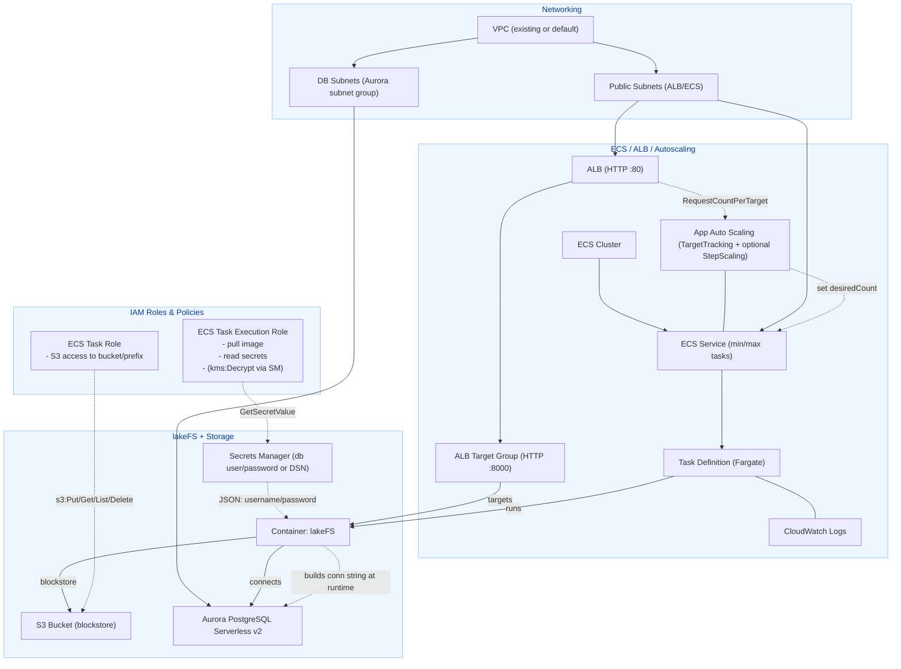

# lakeFS on AWS: Terraform Deployment (ECS Fargate + Aurora PostgreSQL + S3)

This module provisions a production-ready lakeFS deployment on AWS using ECS Fargate, an Application Load Balancer (ALB), Aurora PostgreSQL Serverless v2, and S3 for the blockstore. Secrets Manager is used to provide database credentials to the container securely. The design supports autoscaling of the ECS service and optional scale-to-zero behavior when idle.

## Architecture



### Components

- **Networking**: Uses an existing VPC (or default VPC). Public subnets host the ALB and ECS tasks; DB subnets form the Aurora DB subnet group.
- **Control Plane**: ALB forwards to a target group on port 8000; ECS service runs Fargate tasks from a task definition; Application Auto Scaling adjusts desired task count; CloudWatch collects logs.
- **Data Plane**: lakeFS writes objects to S3 and persists metadata in Aurora PostgreSQL Serverless v2. Secrets Manager holds database credentials (and can optionally hold a full connection string/DSN).
- **IAM**: The ECS task **execution role** pulls the container image and reads secrets (with `secretsmanager:GetSecretValue` and `kms:Decrypt` limited by conditions). The **task role** grants scoped S3 access to the bucket/prefix used by lakeFS.

## Deployment Behavior

- **Autoscaling**: Target tracking on `ALBRequestCountPerTarget` increases/decreases tasks according to request rate. Optional “idle” alarms can step-scale the service to zero tasks when no traffic is observed for a configured period.
- **Database Scaling**: Aurora PostgreSQL Serverless v2 supports scaling between configured minimum and maximum ACUs. Enabling `min_capacity = 0` allows auto-pause to zero; set `min_capacity >= 1` to avoid cold starts.

## Secrets and Database Connectivity

- **Secret injection**: ECS `secrets` inject `DB_USER` and `DB_PASSWORD` from Secrets Manager without exposing values in Terraform state.
- **Connection string**: The container constructs the **libpq conninfo** string at runtime instead of a URL. This avoids issues with special characters in passwords (no percent-encoding required). The only escaping required is doubling single quotes inside the password (`'` → `''`).

**Example runtime command pattern** (executed via `entryPoint = ["/bin/sh","-lc"]`):

```sh
pw_esc=`printf %s "$${DB_PASSWORD}" | sed "s/'/''/g"`
export LAKEFS_DATABASE_POSTGRES_CONNECTION_STRING="host=$${DB_HOST} port=$${DB_PORT} user=$${DB_USER} password='$${pw_esc}' dbname=$${DB_NAME} sslmode=require"
exec /app/lakefs run
```

> Ensure `$` is escaped as `$$` in HCL. Provide `DB_HOST`, `DB_PORT` (as string), and `DB_NAME` via `environment`; inject `DB_USER` and `DB_PASSWORD` via `secrets`.

## Cold-Start Considerations

- With **ECS min tasks = 0** and **Aurora min ACU = 0**, an initial request may arrive before the database resumes. To mitigate:
  - Keep **Aurora min ACU = 1** during business hours; or
  - Add a lightweight **“waker”** Lambda/API that sets `desiredCount = 1`, optionally waits for a healthy target, then redirects; and
  - Include a short **DB wait loop** in the container command before launching lakeFS.

## Security Notes

- Grant the **execution role** least-privilege access to the specific secret ARN (and `: *` versions) with `secretsmanager:GetSecretValue`.
- For KMS-encrypted secrets, allow `kms:Decrypt` constrained by:
  - `kms:ViaService = secretsmanager.<region>.amazonaws.com`
  - `kms:EncryptionContext:aws:secretsmanager:arn = <secret-arn>`
- Scope the **task role** to only the bucket and prefix used by lakeFS (e.g., `s3:GetObject`, `PutObject`, `DeleteObject`, `ListBucket` on `arn:aws:s3:::bucket/prefix*`).