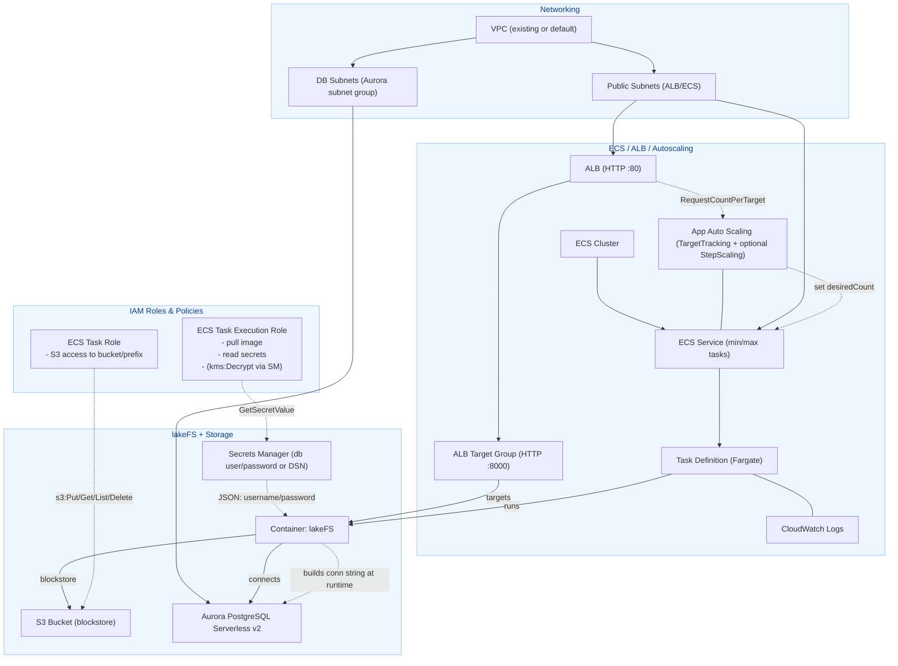

```mermaid
flowchart TD
  %% ========================
  %% lakeFS on ECS + Aurora
  %% ========================

  subgraph Networking
    VPC["VPC (existing or default)"]
    SUBNETS_PUB["Public Subnets (ALB/ECS)"]
    SUBNETS_DB["DB Subnets (Aurora subnet group)"]
    VPC --> SUBNETS_PUB
    VPC --> SUBNETS_DB
  end

  subgraph ControlPlane["ECS / ALB / Autoscaling"]
    ALB["ALB (HTTP :80)"]
    TG["ALB Target Group (HTTP :8000)"]
    ECSCL["ECS Cluster"]
    ECSSVC["ECS Service (min/max tasks)"]
    TDEF["Task Definition (Fargate)"]
    CWAS["App Auto Scaling (TargetTracking + optional StepScaling)"]
    CWL["CloudWatch Logs"]
    ALB --> TG
    ECSCL --> ECSSVC --> TDEF
    CWAS --- ECSSVC
    TDEF --- CWL
  end

  subgraph DataPlane["lakeFS + Storage"]
    LFS["Container: lakeFS"]
    S3["S3 Bucket (blockstore)"]
    RDS["Aurora PostgreSQL Serverless v2"]
    SEC["Secrets Manager (db user/password or DSN)"]
  end

  subgraph IAM["IAM Roles & Policies"]
    EXEC["ECS Task Execution Role\n- pull image\n- read secrets\n- (kms:Decrypt via SM)"]
    TASK["ECS Task Role\n- S3 access to bucket/prefix"]
  end

  %% Wiring
  SUBNETS_PUB --> ALB
  SUBNETS_PUB --> ECSSVC
  SUBNETS_DB --> RDS

  TG -->|targets| LFS
  LFS -->|blockstore| S3
  LFS -->|connects| RDS

  TDEF -->|runs| LFS
  EXEC -.->|GetSecretValue| SEC
  TASK -.->|s3:Put/Get/List/Delete| S3

  %% Env & secrets pattern
  SEC -. JSON: username/password .-> LFS
  LFS -. builds conn string at runtime .-> RDS

  %% Health & scaling signals
  ALB -. RequestCountPerTarget .-> CWAS
  CWAS -. set desiredCount .-> ECSSVC

  %% Notes
  classDef accent fill:#eef7ff,stroke:#8cbcff,color:#0b3d91;
  class Networking,ControlPlane,DataPlane,IAM accent;
```